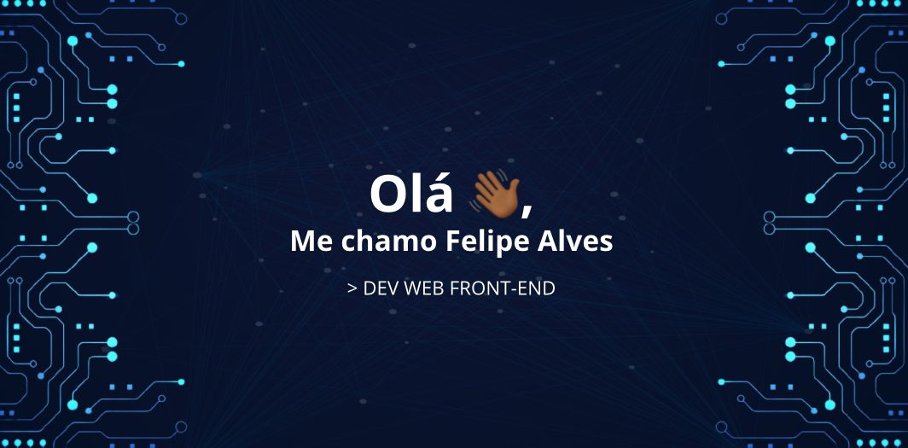

Me chamo Felipe Alves, Cursando Análise e Desenvolvimento de Sistemas pela UCB - Universidade Católica de Brasília. Desenvolvo páginas e sistemas web responsívos e de layout atrativo. Hoje na área de desenvolvimento vivo o aprendizado contínuo, focando em tecnologias JavaScript. Busco oportunidades no mercado como dev e, em um futuro próximo, viso me tornar um desenvolvedor Full Stack.

Apaixonado pela área de tecnologia desde criança, sempre disposto a explorar novas ferramentas nesse imenso mundo da programação. No momento, meu foco de estudos é em React.js. 

📌 [Meu portifólio](https://lipezxss.netlify.app/)

 

   
   
 

 
 
 
 
 
 <!--  -->
 

 ### Minhas redes
 
 
 
 
 
 
 <!--  -->
 

