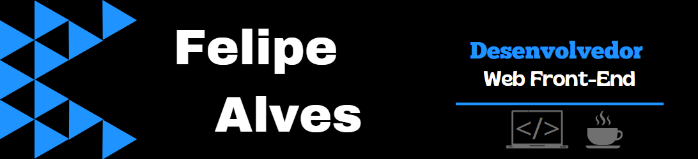

Me chamo Felipe Alves, Cursando Análise e Desenvolvimento de Sistemas pela UCB - Universidade Católica de Brasília. Desenvolvo páginas e sistemas web responsívos e de layout atrativo. Hoje na área de desenvolvimento vivo o aprendizado contínuo, focando em tecnologias JavaScript e React. Busco oportunidades no mercado como dev e, em um futuro próximo, viso me tornar um desenvolvedor Full Stack.

📌 [Meu portifólio](https://lipezxss.netlify.app/)

 

   

   
 

 
 

 

 

 

 

 

 <!--  -->

 

 ### Minhas redes
 
 
 
 
 
 

 
 <!--  -->
 

